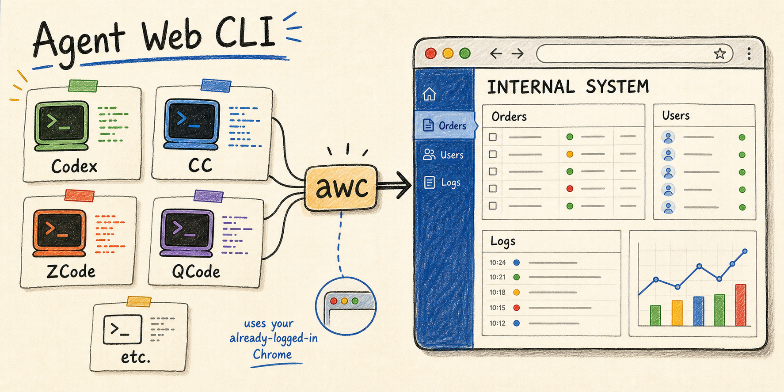
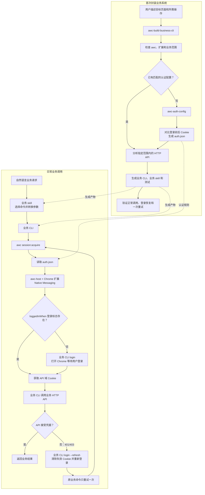

<div align="center">



**[English](README.en.md)** · 简体中文

</div>

`awc` 让 AI agent 和业务 CLI 复用你**已经登录的 Chrome**，从而把需要登录的业务后台
封装成可重复使用的 CLI + skill。不需要保存密码，也不需要再启动 headless 浏览器。

## 1. 快速安装

推荐直接把下面这段话发给 Codex、Claude Code、Cursor 或其他编码 agent：

```text
请安装 https://github.com/liangjfblue/agent-web-cli 。
先阅读仓库的 AGENTS.md，按当前操作系统完成安装并运行 awc sys:setup。
不要输出任何 Cookie、Token 或 session JSON。
完成后告诉我 Chrome 扩展目录、我唯一需要手动完成的步骤，并运行 awc sys:status 验证。
```

Agent 会下载或构建 `awc`、注册 Native Messaging Host，并安装两个配套 skill：

- `awc-auth-config`：识别网站的登录标志并生成认证配置。
- `awc-build-business-cli`：根据业务需求生成 CLI + 业务 skill。

Chrome 不允许静默安装未打包扩展，因此你只需要手动完成一次：

1. 在地址栏打开 `chrome://extensions`。
2. 开启**开发者模式**，点击**加载未打包的扩展程序**。
3. 选择 Agent 告诉你的 `extension` 目录。

看到 `awc sys:status` 显示 host 和 extension 已连接，就安装完成了。

<details>
<summary>不使用 Agent，手动安装</summary>

macOS / Linux：

```sh
curl -fsSL https://raw.githubusercontent.com/liangjfblue/agent-web-cli/main/install.sh | bash
```

Windows：从 [Releases](https://github.com/liangjfblue/agent-web-cli/releases) 下载
`awc-windows-amd64-<ver>.zip`，解压后运行：

```powershell
.\bin\awc.exe sys:setup
```

然后按上面的三个步骤加载扩展并运行 `awc sys:status`。

</details>

## 2. 用 Skill 封装业务 CLI + Skill

先在 Chrome 登录目标业务系统并打开需要封装的页面，然后直接告诉 Agent：

```text
使用 awc-build-business-cli，把当前已经登录的后台封装成 CLI + skill。
需要支持：订单列表、订单详情、创建订单和取消订单。
```

把最后一行换成你的真实需求即可。查询、新增、更新、删除都可以支持，不预置 `user`、
`role` 等固定业务资源。

Agent 会完成：

1. 检查 `awc`、Chrome 扩展和当前登录态。
2. 使用 `awc-auth-config` 识别登录 Cookie，只保存 Cookie 名称和登录规则，不保存值。
3. 分析用户指定范围内的 HTTP API。
4. 生成业务 CLI、认证配置、测试和对应的业务 skill。
5. 验证正常调用、登录过期、重新登录和原命令重试。

生成完成后，不需要记 CLI 参数，继续用自然语言即可：

```text
查询今天创建的订单
创建一个测试订单，商品 ID 是 1001，数量 2
取消订单 20260811001
```

业务 skill 会把自然语言转换成确定的 CLI 命令。登录过期时，它会打开登录页，等待你完成
密码、SSO 或验证码，再重试原命令一次。

对于新增、更新、删除等写操作，Agent 必须先确定具体目标和影响；不能为了分析接口或测试
CLI 而随意修改真实数据。Cookie、Token、JWT 和 `cookieHeader` 不能出现在终端输出、日志、
源码或 skill 中。

可以参考三个示例：

- [`demo-admin`](example/demo-admin/)：模拟订单后台。
- [`demo-svcgov`](example/demo-svcgov/)：模拟服务治理后台。
- [`ruoyi-cli`](example/ruoyi-cli/)：基于 [RuoYi 在线演示站](https://vue.ruoyi.vip/index)
  的真实用户/角色查询和登录恢复。

## 3. 实现原理

整个流程分为首次封装和日常调用两部分。认证配置只记录 Cookie 名称、URL 和登录规则；
Cookie、Token 等凭据始终保留在 Chrome 中，只在业务 CLI 进程内短暂使用。



---

**给 Agent 和业务 CLI 开发者的完整约定：** [AGENTS.md](AGENTS.md)

**模拟后台演示：** [example/DEMO-WALKTHROUGH.md](example/DEMO-WALKTHROUGH.md)

**CLI 命令：** `awc --help` / `awc <command> --help`

<details>
<summary>为什么发行包里有 awc 和 awc-host 两个程序？</summary>

`awc` 是用户和业务 CLI 调用的命令；`awc-host` 是 Chrome 自动启动的 Native Messaging
桥接进程，不需要手动运行。它们通过当前用户范围的 Named Pipe 或私有 Unix socket 通信，
不开本地 HTTP/WebSocket 端口。Chrome 扩展断开后，`awc-host` 会退出。

</details>

<details>
<summary>开发和测试</summary>

```sh
./scripts/build.sh
./scripts/cross-build.sh --pack

go test ./...
go vet ./...
node --test example/ruoyi-cli/test/cli.test.js
```

</details>
